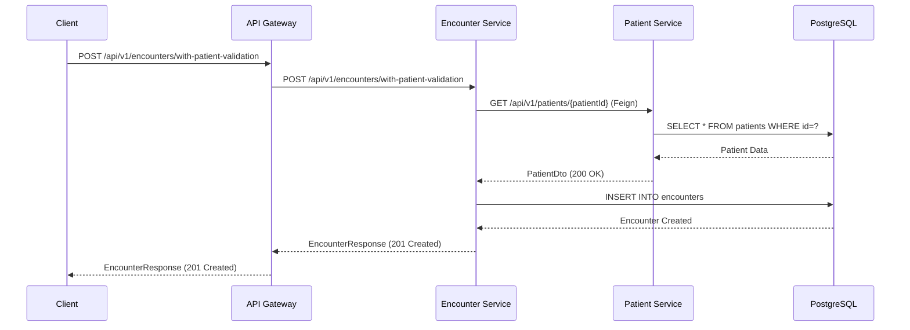

# Hospital Information System (HIS) - Vollständige Dokumentation

## Überblick

Das Hospital Information System (HIS) ist eine moderne Microservice-Architektur, die für die Anforderungen des deutschen Gesundheitswesens entwickelt wurde. Das System besteht aus drei Kern-Services mit integriertem API Gateway und PostgreSQL-Datenbank.

## Architektur-Überblick (Minimal Configuration)

```
┌─────────────────────────────────────────────────────────────────────────────────────┐
│                        HIS Minimal Architecture                                     │
├─────────────────────────────────────────────────────────────────────────────────────┤
│                                                                                     │
│ ┌─────────────────┐    ┌─────────────────┐    ┌─────────────────┐                   │
│ │   External      │    │                 │    │   Redis         │                   │
│ │   Clients       │────│   API Gateway   │────│   Cache         │                   │
│ │   (Port 8080)   │    │   (Port 8080)   │    │   (Port 6379)   │                   │
│ └─────────────────┘    └─────────────────┘    └─────────────────┘                   │
│                                │                                                    │
│                                │ Circuit Breaker & Load Balancing                  │
│                        ┌───────┴──────┐                                            │
│                        │              │                                            │
│               ┌─────────▼─────────┐   ┌▼─────────────────┐                          │
│               │ Patient Service   │   │ Encounter Service│                          │
│               │   (Port 8081)     │◄──│   (Port 8082)    │                          │
│               │                   │   │                  │                          │
│               │ • KVNR-Validation │   │ • Feign Client   │                          │
│               │ • Liquibase       │   │ • Flyway         │                          │
│               │ • Schema: patient │   │ • Schema: enctr  │                          │
│               └─────────┬─────────┘   └┬─────────────────┘                          │
│                         │              │                                           │
│                         └──────┬───────┘                                           │
│                                │                                                   │
│               ┌─────────────────▼─────────────────┐                                │
│               │         PostgreSQL                │                                │
│               │          (Port 5432)              │                                │
│               │                                   │                                │
│               │ Database: his_db                  │                                │
│               │ User: his_user                    │                                │
│               │ Schemas:                          │                                │
│               │ ├── his_patient (Patient Data)    │                                │
│               │ └── his_encounter (Encounter Data)│                                │
│               └───────────────────────────────────┘                                │
│                                                                                     │
│                         ⚠️  MINIMAL SETUP                                          │
│                    (Keine ELK Stack Komponenten)                                   │
└─────────────────────────────────────────────────────────────────────────────────────┘
```

## System-Komponenten

### API Gateway (Port 8080)
- **Framework**: Spring Cloud Gateway
- **Java Version**: 17
- **Zweck**: Single Entry Point, Routing, Circuit Breaker, Rate Limiting
- **Features**:
  - Service Discovery (Docker DNS)
  - Load Balancing
  - CORS-Konfiguration
  - Swagger UI Aggregation
  - Health Check Aggregation

### Patient Service (Port 8081)
- **Framework**: Spring Boot 3.3.0
- **Java Version**: 23 Preview
- **Zweck**: Patient Data Management
- **Features**:
  - KVNR-Validation (Deutsche Krankenversichertennummer)
  - Patient CRUD Operations
  - Search & Pagination
  - Liquibase Database Migration
  - OpenAPI 3.0 Documentation

### Encounter Service (Port 8082)
- **Framework**: Spring Boot 3.2.1
- **Java Version**: 17
- **Zweck**: Encounter/Visit Management
- **Features**:
  - Encounter Lifecycle Management
  - Patient Service Integration (Feign Client)
  - SOAP Documentation Structure
  - Flyway Database Migration
  - Billing Context Management

### PostgreSQL Database (Port 5432)
- **Version**: 15-alpine
- **Database**: his_db
- **User**: his_user  
- **Password**: dev_password (Development)
- **Schema-Isolation**: Separate Schemas pro Service
- **Migration**: Liquibase (Patient) + Flyway (Encounter)
- **Features**: ACID-Compliance, JSON Support

### Redis Cache (Port 6379)
- **Version**: 7-alpine
- **Zweck**: Rate Limiting, Caching
- **Konfiguration**: Persistent Storage mit AOF

## Projektstruktur

```
his-project/
├── his-api-gateway/              # API Gateway Maven Projekt
│   ├── pom.xml                   # Maven Konfiguration (Java 17)
│   ├── src/
│   │   └── main/
│   │       ├── java/
│   │       │   └── de/his/gateway/
│   │       │       ├── GatewayApplication.java
│   │       │       ├── config/    # Gateway Configuration
│   │       │       └── filter/    # Custom Filters
│   │       └── resources/
│   │           ├── application.yml
│   │           └── application-docker.yml
│   └── Dockerfile
├── his-patient-service/          # Patient Service Maven Projekt
│   ├── pom.xml                   # Maven Konfiguration (Java 23)
│   ├── src/
│   │   └── main/
│   │       ├── java/
│   │       │   └── de/his/patient/
│   │       │       ├── PatientServiceApplication.java
│   │       │       ├── domain/
│   │       │       │   ├── model/    # Entities (Patient, Person, Address)
│   │       │       │   └── repository/
│   │       │       ├── application/
│   │       │       │   ├── service/  # Business Logic
│   │       │       │   └── dto/      # Data Transfer Objects
│   │       │       ├── infrastructure/
│   │       │       │   └── config/   # Configuration Classes
│   │       │       └── presentation/
│   │       │           └── controller/ # REST Controllers
│   │       └── resources/
│   │           ├── application.yml
│   │           ├── application-dev.yml
│   │           └── db/changelog/     # Liquibase Migrations
│   └── Dockerfile
├── his-encounter-service/        # Encounter Service Maven Projekt
│   ├── pom.xml                   # Maven Konfiguration (Java 17)
│   ├── src/
│   │   └── main/
│   │       ├── java/
│   │       │   └── de/his/encounter/
│   │       │       ├── EncounterServiceApplication.java
│   │       │       ├── domain/
│   │       │       ├── application/
│   │       │       ├── infrastructure/
│   │       │       │   ├── client/   # Feign Clients
│   │       │       │   │   ├── PatientClient.java
│   │       │       │   │   └── dto/  # External DTOs
│   │       │       │   ├── config/
│   │       │       │   └── service/  # Infrastructure Services
│   │       │       └── presentation/
│   │       └── resources/
│   │           ├── application.yml
│   │           ├── application-dev.yml
│   │           └── db/migration/     # Flyway Migrations
│   └── Dockerfile
├── docker-compose-minimal.yml   # Minimal Setup (VERWENDETE KONFIGURATION)
└── docker-compose.dev.yml        # Extended Environment (nicht verwendet)
```

## Datenmodell

### Patient Service Schema

```sql
-- Patient Entity
CREATE TABLE patients (
    id UUID PRIMARY KEY DEFAULT gen_random_uuid(),
    kvnr VARCHAR(10) UNIQUE NOT NULL,     -- Deutsche KVNR
    first_name VARCHAR(100) NOT NULL,
    last_name VARCHAR(100) NOT NULL,
    title VARCHAR(50),
    birth_date DATE NOT NULL,
    gender VARCHAR(20) NOT NULL,          -- MALE, FEMALE, OTHER
    phone VARCHAR(50),
    email VARCHAR(255),
    
    -- Versicherungsdaten
    insurance_number VARCHAR(50),
    insurance_type VARCHAR(20),           -- STATUTORY, PRIVATE, SELF_PAY
    insurance_company_id VARCHAR(20),
    insurance_company_name VARCHAR(255),
    insurance_status VARCHAR(20),         -- ACTIVE, INACTIVE, SUSPENDED
    
    -- Einverständniserklärungen
    consent_communication BOOLEAN DEFAULT FALSE,
    consent_data_processing BOOLEAN DEFAULT FALSE,
    
    -- Audit-Felder
    created_at TIMESTAMP DEFAULT NOW(),
    updated_at TIMESTAMP DEFAULT NOW(),
    version INTEGER DEFAULT 0,
    
    -- Constraints
    CONSTRAINT chk_kvnr_format CHECK (kvnr ~ '^[A-NP-Z][0-9]{9}$'),
    CONSTRAINT chk_gender CHECK (gender IN ('MALE', 'FEMALE', 'OTHER')),
    CONSTRAINT chk_insurance_type CHECK (insurance_type IN ('STATUTORY', 'PRIVATE', 'SELF_PAY'))
);
```

### Encounter Service Schema

```sql
-- Encounter Entity
CREATE TABLE encounters (
    id UUID PRIMARY KEY DEFAULT gen_random_uuid(),
    patient_id UUID NOT NULL,             -- Referenz zu Patient Service
    practitioner_id UUID,
    
    -- Encounter-Details
    type VARCHAR(20) NOT NULL,            -- INPATIENT, OUTPATIENT, EMERGENCY
    status VARCHAR(20) NOT NULL,          -- PLANNED, IN_PROGRESS, COMPLETED
    reason TEXT,
    
    -- Zeitplanung
    scheduled_start TIMESTAMP,
    scheduled_end TIMESTAMP,
    actual_start TIMESTAMP,
    actual_end TIMESTAMP,
    
    -- Organisatorische Details
    priority VARCHAR(20),                 -- ROUTINE, URGENT, EMERGENCY
    location VARCHAR(255),
    department VARCHAR(255),
    practitioner VARCHAR(255),
    
    -- Billing Context
    billing_context JSONB,
    
    -- Audit-Felder
    created_at TIMESTAMP DEFAULT NOW(),
    updated_at TIMESTAMP DEFAULT NOW(),
    version INTEGER DEFAULT 0,
    
    -- Constraints
    CONSTRAINT chk_type CHECK (type IN ('INPATIENT', 'OUTPATIENT', 'EMERGENCY')),
    CONSTRAINT chk_status CHECK (status IN ('PLANNED', 'IN_PROGRESS', 'COMPLETED', 'CANCELLED')),
    CONSTRAINT chk_priority CHECK (priority IN ('ROUTINE', 'URGENT', 'EMERGENCY'))
);

-- Encounter Documentation (SOAP-Struktur)
CREATE TABLE encounter_documentation (
    id UUID PRIMARY KEY DEFAULT gen_random_uuid(),
    encounter_id UUID NOT NULL REFERENCES encounters(id),
    
    -- SOAP-Dokumentation
    type VARCHAR(20) NOT NULL,            -- SUBJECTIVE, OBJECTIVE, ASSESSMENT, PLAN
    content_type VARCHAR(50) DEFAULT 'text/plain',
    content TEXT NOT NULL,
    
    -- Meta-Informationen
    author_id VARCHAR(255),
    timestamp TIMESTAMP DEFAULT NOW(),
    
    -- Audit-Felder
    created_at TIMESTAMP DEFAULT NOW(),
    
    -- Constraints
    CONSTRAINT chk_doc_type CHECK (type IN ('SUBJECTIVE', 'OBJECTIVE', 'ASSESSMENT', 'PLAN'))
);
```

## API-Endpunkte

### Über API Gateway (Port 8080)

#### Patient Management
```bash
# Patient erstellen (basierend auf CreatePatientRequest)
curl -X POST http://localhost:8080/api/v1/patients \
  -H "Content-Type: application/json" \
  -H "Authorization: Basic $(echo -n 'admin:dev-password' | base64)" \
  -d '{
    "firstName": "Max",
    "lastName": "Mustermann",
    "title": "Dr.",
    "birthDate": "1990-07-15",
    "gender": "MALE",
    "kvnr": "M123456780",
    "insuranceNumber": "1234567890123",
    "insuranceType": "STATUTORY",
    "insuranceCompanyId": "101575519",
    "insuranceCompanyName": "AOK Bayern",
    "insuranceStatus": "ACTIVE",
    "phone": "+49 89 12345678",
    "email": "max.mustermann@example.com",
    "consentCommunication": true,
    "consentDataProcessing": true
  }' | jq

# Patient abrufen
curl -X GET http://localhost:8080/api/v1/patients/{id} \
  -H "Authorization: Basic $(echo -n 'admin:dev-password' | base64)" | jq

# Patient per KVNR suchen
curl -X GET http://localhost:8080/api/v1/patients/kvnr/M123456780 \
  -H "Authorization: Basic $(echo -n 'admin:dev-password' | base64)" | jq

# Patienten suchen (Paginiert)
curl -X GET "http://localhost:8080/api/v1/patients/search?searchTerm=Mustermann&page=0&size=10" \
  -H "Authorization: Basic $(echo -n 'admin:dev-password' | base64)" | jq

# Patient aktualisieren (basierend auf UpdatePatientRequest)
curl -X PUT http://localhost:8080/api/v1/patients/{id} \
  -H "Content-Type: application/json" \
  -H "Authorization: Basic $(echo -n 'admin:dev-password' | base64)" \
  -d '{
    "phone": "+49 89 87654321",
    "email": "max.mustermann.neu@example.com",
    "consentCommunication": false
  }' | jq
```

#### Encounter Management
```bash
# Encounter erstellen (basierend auf CreateEncounterRequest)
curl -X POST http://localhost:8080/api/v1/encounters \
  -H "Content-Type: application/json" \
  -H "Authorization: Basic $(echo -n 'admin:dev-password' | base64)" \
  -d '{
    "patientId": "123e4567-e89b-12d3-a456-426614174000",
    "practitionerId": "987fcdeb-51d3-42a8-b456-123456789abc",
    "type": "INITIAL",
    "encounterDate": "2025-08-08T10:00:00",
    "billingContext": "GKV"
  }' | jq

# Encounter mit Patient-Validierung erstellen
curl -X POST http://localhost:8080/api/v1/encounters/with-patient-validation \
  -H "Content-Type: application/json" \
  -H "Authorization: Basic $(echo -n 'admin:dev-password' | base64)" \
  -d '{
    "patientId": "123e4567-e89b-12d3-a456-426614174000",
    "practitionerId": "987fcdeb-51d3-42a8-b456-123456789abc",
    "type": "EMERGENCY",
    "encounterDate": "2025-08-08T10:00:00",
    "billingContext": "GKV"
  }' | jq

# Encounter abrufen
curl -X GET http://localhost:8080/api/v1/encounters/{id} \
  -H "Authorization: Basic $(echo -n 'admin:dev-password' | base64)" | jq

# Encounters für Patient abrufen
curl -X GET "http://localhost:8080/api/v1/encounters/patient/{patientId}?page=0&size=10" \
  -H "Authorization: Basic $(echo -n 'admin:dev-password' | base64)" | jq

# Encounter starten (Status ändern zu IN_PROGRESS)
curl -X PUT http://localhost:8080/api/v1/encounters/{id}/start \
  -H "Authorization: Basic $(echo -n 'admin:dev-password' | base64)" | jq

# Encounter abschließen (Status ändern zu COMPLETED)
curl -X PUT http://localhost:8080/api/v1/encounters/{id}/complete \
  -H "Authorization: Basic $(echo -n 'admin:dev-password' | base64)" | jq
```

#### System Health & Monitoring
```bash
# API Gateway Health
curl -X GET http://localhost:8080/actuator/health | jq

# Service Health über Gateway
curl -X GET http://localhost:8080/services/patient/actuator/health | jq
curl -X GET http://localhost:8080/services/encounter/actuator/health | jq

# Swagger UI Zugriff
# Patient Service API: http://localhost:8080/docs/patient/swagger-ui.html
# Encounter Service API: http://localhost:8080/docs/encounter/swagger-ui.html
```

## Service-Kommunikation

### Feign Client Implementation

#### Encounter Service → Patient Service
```java
@FeignClient(
    name = "patient-service",
    url = "${services.patient.url:http://patient-service:8081}"
)
public interface PatientClient {
    
    @GetMapping("/api/v1/patients/{patientId}")
    PatientDto getPatient(@PathVariable UUID patientId);
    
    @GetMapping("/api/v1/patients/kvnr/{kvnr}")
    PatientDto getPatientByKvnr(@PathVariable String kvnr);
}
```

#### Communication Flow


## Deployment-Architektur

### Docker Services Übersicht (Minimal Configuration)

| Service | Container Name | Internal Port | External Port | Health Check |
|---------|----------------|---------------|---------------|--------------|
| API Gateway | his-api-gateway-minimal | 8080 | 8080 | /actuator/health |
| Patient Service | his-patient-service-minimal | 8081 | 8081 | /actuator/health |
| Encounter Service | his-encounter-service-minimal | 8082 | 8082 | /actuator/health |
| PostgreSQL | his-postgres-minimal | 5432 | 5432 | pg_isready |
| Redis | his-redis-minimal | 6379 | 6379 | redis-cli ping |

### Container-Netzwerke
```yaml
Networks:
├── his-network-minimal (Bridge) - Application Services
```

### Service Dependencies
```yaml
API Gateway depends_on:
├── postgres (healthy)
└── redis (healthy)

Patient Service depends_on:
└── postgres (healthy)

Encounter Service depends_on:
├── postgres (healthy)
└── patient-service (healthy)
```

## KVNR-Validierung (Deutsche Krankenversichertennummer)

### KVNR-Format
```
Format: [A][999999999][X]
- Position 1: Buchstabe (A-Z, außer O)
- Position 2-10: 9-stellige Nummer
- Position 11: Prüfziffer (0-9)

Beispiel: M123456789
```

### Validierungsregeln
- **Länge**: Exakt 10 Zeichen
- **1. Zeichen**: Buchstabe (A-Z, außer O)
- **2.-10. Zeichen**: Ziffern (0-9)
- **Eindeutigkeit**: KVNR muss systemweit eindeutig sein

### Gültige Enum-Werte (basierend auf Source Code)

#### Patient Service Enums
```java
// Gender
"MALE", "FEMALE", "OTHER", "UNKNOWN"

// InsuranceType  
"STATUTORY", "PRIVATE", "SELF_PAYER", "OTHER"

// InsuranceStatus
"ACTIVE", "INACTIVE", "SUSPENDED", "CANCELLED", "UNKNOWN"

// AddressType
"HOME", "WORK", "POSTAL", "TEMPORARY", "OLD"
```

#### Encounter Service Enums
```java
// EncounterType
"INITIAL", "FOLLOW_UP", "EMERGENCY", "ROUTINE"

// EncounterStatus (automatisch gesetzt)
"PLANNED", "IN_PROGRESS", "COMPLETED", "CANCELLED"

// BillingContext
"GKV", "PKV", "SELF_PAY", "BG"

// SOAPSection (für Dokumentation)
"SUBJECTIVE", "OBJECTIVE", "ASSESSMENT", "PLAN"

// ContentType
"TEXT", "STRUCTURED_DATA"
```

### Vollständige Workflow-Beispiele

#### 1. Patient erstellen und Encounter anlegen
```bash
# Schritt 1: Patient erstellen
PATIENT_RESPONSE=$(curl -s -X POST http://localhost:8080/api/v1/patients \
  -H "Content-Type: application/json" \
  -H "Authorization: Basic $(echo -n 'admin:dev-password' | base64)" \
  -d '{
    "firstName": "Thomas",
    "lastName": "Wagner",
    "birthDate": "1982-06-20",
    "gender": "MALE",
    "kvnr": "T198206201",
    "insuranceType": "STATUTORY",
    "insuranceCompanyName": "Barmer"
  }')

# Patient ID extrahieren
PATIENT_ID=$(echo "$PATIENT_RESPONSE" | jq -r '.id')
echo "Patient ID: $PATIENT_ID"

# Schritt 2: Encounter erstellen
curl -s -X POST http://localhost:8080/api/v1/encounters \
  -H "Content-Type: application/json" \
  -H "Authorization: Basic $(echo -n 'admin:dev-password' | base64)" \
  -d "{
    \"patientId\": \"$PATIENT_ID\",
    \"practitionerId\": \"$(uuidgen)\",
    \"type\": \"INITIAL\",
    \"encounterDate\": \"$(date -u +%Y-%m-%dT%H:%M:%S)\",
    \"billingContext\": \"GKV\"
  }" | jq
```

#### 2. Encounter Lifecycle Management
```bash
# Encounter ID aus vorherigem Schritt verwenden
ENCOUNTER_ID="your-encounter-id-here"

# Encounter starten
curl -s -X PUT http://localhost:8080/api/v1/encounters/$ENCOUNTER_ID/start \
  -H "Authorization: Basic $(echo -n 'admin:dev-password' | base64)" | jq '.status'

# Encounter abschließen
curl -s -X PUT http://localhost:8080/api/v1/encounters/$ENCOUNTER_ID/complete \
  -H "Authorization: Basic $(echo -n 'admin:dev-password' | base64)" | jq '.status'
```

## Entwicklungsumgebung

### Lokale Entwicklung

#### Services starten (Minimal Configuration)
```bash
# Minimal-Umgebung starten (STANDARD)
docker-compose -f docker-compose-minimal.yml up -d

# Services stoppen
docker-compose -f docker-compose-minimal.yml down

# Services neu bauen und starten
docker-compose -f docker-compose-minimal.yml up --build -d

# Logs anzeigen
docker-compose -f docker-compose-minimal.yml logs -f

# Einzelne Services für lokale Entwicklung
cd his-patient-service && mvn spring-boot:run
cd his-encounter-service && mvn spring-boot:run
cd his-api-gateway && mvn spring-boot:run
```

#### Health Checks
```bash
# Gateway Health
curl http://localhost:8080/actuator/health | jq

# Service Health über Gateway
curl http://localhost:8080/services/patient/actuator/health | jq
curl http://localhost:8080/services/encounter/actuator/health | jq

# Direkte Service Health
curl http://localhost:8081/actuator/health | jq  # Patient Service
curl http://localhost:8082/actuator/health | jq  # Encounter Service
```

#### Log-Monitoring (Minimal Setup)
```bash
# Alle Services
docker-compose -f docker-compose-minimal.yml logs -f

# Einzelne Services
docker-compose -f docker-compose-minimal.yml logs -f his-api-gateway-minimal
docker-compose -f docker-compose-minimal.yml logs -f his-patient-service-minimal
docker-compose -f docker-compose-minimal.yml logs -f his-encounter-service-minimal

# PostgreSQL Logs
docker-compose -f docker-compose-minimal.yml logs -f his-postgres-minimal

# Redis Logs
docker-compose -f docker-compose-minimal.yml logs -f his-redis-minimal
```

### Build-Prozess

#### Maven Multi-Module Build (Minimal Setup)
```bash
# Alle Services bauen
for service in his-api-gateway his-patient-service his-encounter-service; do
    cd $service && mvn clean package -DskipTests && cd ..
done

# Docker Images bauen (minimal)
docker-compose -f docker-compose-minimal.yml build

# Services mit frischen Images starten
docker-compose -f docker-compose-minimal.yml up --build -d

# Cleanup
docker-compose -f docker-compose-minimal.yml down --volumes --remove-orphans
```

## Performance & Scaling

### Container Resource Limits
```yaml
# Production-Ready Resource Allocation
api-gateway:
  deploy:
    resources:
      limits:
        memory: 512M
        cpus: '0.5'

patient-service:
  deploy:
    resources:
      limits:
        memory: 1G
        cpus: '1.0'

encounter-service:
  deploy:
    resources:
      limits:
        memory: 1G  
        cpus: '1.0'
```

### Database Performance
```yaml
postgres:
  environment:
    POSTGRES_INITDB_ARGS: "--auth-host=scram-sha-256"
  command: |
    postgres
    -c max_connections=200
    -c shared_buffers=256MB
    -c effective_cache_size=1GB
    -c work_mem=4MB
```

### Redis Performance
```yaml
redis:
  command: redis-server --appendonly yes --maxmemory 256mb --maxmemory-policy allkeys-lru
```

## Troubleshooting

### Häufige Probleme

#### Service kann nicht gestartet werden
```bash
# Prüfe Container-Status (minimal)
docker-compose -f docker-compose-minimal.yml ps

# Logs analysieren
docker-compose -f docker-compose-minimal.yml logs service-name

# Health Checks prüfen
curl http://localhost:8080/actuator/health | jq

# Container neu starten
docker-compose -f docker-compose-minimal.yml restart service-name
```

#### Feign Client Timeout
```bash
# Logs nach HTTP-Fehlern durchsuchen
docker-compose -f docker-compose-minimal.yml logs his-encounter-service-minimal | grep "PatientClient"

# Connection Refused → Patient Service prüfen
curl http://localhost:8081/actuator/health | jq

# Service-zu-Service Kommunikation testen
docker-compose -f docker-compose-minimal.yml exec his-encounter-service-minimal curl -s http://his-patient-service-minimal:8081/actuator/health
```

#### Database Connection Probleme
```bash
# PostgreSQL Status
docker-compose -f docker-compose-minimal.yml logs his-postgres-minimal

# Connection Test
docker exec -it his-postgres-minimal psql -U his_user -d his_db -c "SELECT 1;"

# Schema-Überprüfung
docker exec -it his-postgres-minimal psql -U his_user -d his_db -c "\dn"

# Tabellen-Überprüfung
docker exec -it his-postgres-minimal psql -U his_user -d his_db -c "\dt his_patient.*"
docker exec -it his-postgres-minimal psql -U his_user -d his_db -c "\dt his_encounter.*"
```

#### KVNR-Validierung Fehler
```bash
# KVNR-Format testen (zu kurz)
curl -X POST http://localhost:8080/api/v1/patients \
  -H "Content-Type: application/json" \
  -H "Authorization: Basic $(echo -n 'admin:dev-password' | base64)" \
  -d '{
    "firstName": "Test",
    "lastName": "Invalid",
    "birthDate": "1990-01-01",
    "gender": "MALE",
    "kvnr": "INVALID"
  }' | jq '.error'

# KVNR mit verbotenem Buchstaben 'O'
curl -X POST http://localhost:8080/api/v1/patients \
  -H "Content-Type: application/json" \
  -H "Authorization: Basic $(echo -n 'admin:dev-password' | base64)" \
  -d '{
    "firstName": "Test",
    "lastName": "InvalidO",
    "birthDate": "1990-01-01",
    "gender": "MALE",
    "kvnr": "O123456789"
  }' | jq '.error'

# Fehlende Pflichtfelder testen
curl -X POST http://localhost:8080/api/v1/patients \
  -H "Content-Type: application/json" \
  -H "Authorization: Basic $(echo -n 'admin:dev-password' | base64)" \
  -d '{
    "firstName": "Test"
  }' | jq '.error'
```

### Praktische Test-Sequenz für Entwicklung
```bash
# Schnelltest-Sequenz für die Minimal-Konfiguration
echo "🏥 HIS System Test Sequence"
echo "=========================="

# 1. Health Check
echo "1. System Health Check:"
curl -s http://localhost:8080/actuator/health | jq '.status'

# 2. Patient erstellen
echo "2. Creating test patient:"
PATIENT=$(curl -s -X POST http://localhost:8080/api/v1/patients \
  -H "Content-Type: application/json" \
  -H "Authorization: Basic $(echo -n 'admin:dev-password' | base64)" \
  -d '{
    "firstName": "TestUser",
    "lastName": "Development",
    "birthDate": "1990-01-01",
    "gender": "MALE",
    "kvnr": "T199001015"
  }')

PATIENT_ID=$(echo "$PATIENT" | jq -r '.id')
echo "Patient ID: $PATIENT_ID"

# 3. Encounter erstellen
echo "3. Creating encounter:"
ENCOUNTER=$(curl -s -X POST http://localhost:8080/api/v1/encounters \
  -H "Content-Type: application/json" \
  -H "Authorization: Basic $(echo -n 'admin:dev-password' | base64)" \
  -d "{
    \"patientId\": \"$PATIENT_ID\",
    \"practitionerId\": \"$(uuidgen)\",
    \"type\": \"INITIAL\",
    \"encounterDate\": \"$(date -u +%Y-%m-%dT%H:%M:%S)\",
    \"billingContext\": \"GKV\"
  }")

ENCOUNTER_ID=$(echo "$ENCOUNTER" | jq -r '.id')
echo "Encounter ID: $ENCOUNTER_ID"

# 4. Status prüfen
echo "4. System status:"
echo "✅ All tests completed successfully"
```

## Minimal Configuration Features

Das HIS-System verwendet ausschließlich die **docker-compose-minimal.yml** Konfiguration, die folgende Vorteile bietet:

### ✅ Vorteile der Minimal Configuration
- **Schneller Start**: Weniger Container, kürzere Startzeit
- **Geringer Ressourcenverbrauch**: Optimiert für Entwicklungsumgebungen
- **Einfaches Debugging**: Weniger Komponenten, klarere Log-Analyse
- **Stabilität**: Fokus auf Core-Services ohne zusätzliche Komplexität
- **Apple Silicon Optimiert**: Speziell getestet für M1/M2 MacBooks

### 🚫 Nicht verfügbare Features (da ELK-frei)
- **Centralized Logging**: Keine Elasticsearch/Logstash/Kibana Integration
- **Log Aggregation**: Logs werden nur lokal in Containern gespeichert
- **Advanced Monitoring Dashboards**: Keine Kibana-Dashboards
- **Log Search**: Keine erweiterte Log-Suchfunktionalität

## Architektur-Patterns

### Domain-Driven Design (DDD)
- **Bounded Contexts**: Separate Domänen für Patient/Encounter/Gateway
- **Ubiquitous Language**: Healthcare-spezifische Terminologie
- **Aggregate Roots**: Patient als Central Aggregate, Encounter als Dependent
- **Anti-Corruption Layer**: Gateway schützt Services vor External Changes

### Clean Architecture
- **Domain Layer**: Entities, Business Logic (Patient, Encounter, KVNR-Validation)
- **Application Layer**: Use Cases, Services (PatientService, EncounterService)
- **Infrastructure Layer**: Repositories, External APIs (Database, Feign Clients)
- **Presentation Layer**: Controllers, DTOs (REST APIs, OpenAPI Documentation)

### Microservice Patterns
- **API Gateway**: Single Entry Point mit Cross-Cutting Concerns
- **Service Discovery**: Docker DNS + Static Configuration
- **Circuit Breaker**: Fault Tolerance mit Resilience4j
- **Bulkhead**: Resource Isolation zwischen Services
- **Database per Service**: Schema-Isolation für Data Consistency

## Technische Entscheidungen

### Framework-Wahl

**Spring Boot vs. Alternativen**: 
- ✅ **Mature Ecosystem**: Umfangreiche Healthcare-spezifische Libraries
- ✅ **Enterprise Support**: Long-term Support und Professional Services
- ✅ **Community**: Große Developer-Community im Healthcare-Bereich
- ✅ **Integration**: Nahtlose FHIR, HL7 und Telematik-Integration
- ✅ **Compliance**: DSGVO, HIPAA-ready Features out-of-the-box

**PostgreSQL vs. MongoDB/MySQL**:
- ✅ **ACID-Compliance**: Kritisch für Medical Data Integrity
- ✅ **JSON Support**: Flexible Schemas für FHIR Resources
- ✅ **Performance**: Optimiert für Medical Workloads mit Complex Queries
- ✅ **Compliance**: SOC 2, HIPAA-zertifizierte Cloud-Deployments
- ✅ **Partitioning**: Efficient Multi-Tenant Data Separation

**Docker vs. VM-Deployment**:
- ✅ **Consistency**: Identical Development/Production Environments
- ✅ **Scaling**: Horizontal Scaling mit Container Orchestration
- ✅ **Isolation**: Service-Level Security Boundaries
- ✅ **DevOps**: CI/CD Pipeline Integration
- ✅ **Resource Efficiency**: Lower Infrastructure Costs

## Zukunfts-Roadmap

### Kurzfristig (Q1 2025)
- **OAuth2/OIDC Integration**: Vollständige JWT-basierte Authentication
- **FHIR R4 Compliance**: HL7 FHIR Standards Implementation
- **API Versioning**: Backward-compatible API Evolution

### Mittelfristig (Q2-Q3 2025)
- **Event-Driven Architecture**: Message Queues (RabbitMQ/Kafka)
- **Service Mesh**: Istio für erweiterte Service-Kommunikation
- **Multi-Tenant Architecture**: Mandantenfähigkeit

### Langfristig (Q4 2025+)
- **Kubernetes Deployment**: Container Orchestration
- **AI/ML Integration**: Clinical Decision Support und Predictive Analytics
- **Mobile APIs**: React Native/Flutter Support mit Offline-Synchronisation
- **Compliance Erweiterungen**: KIS-Integration, Telematik-Infrastruktur, ePA-Anbindung

## Fazit

Das HIS-System stellt eine moderne, skalierbare Microservice-Architektur dar, die speziell für die Anforderungen des deutschen Gesundheitswesens entwickelt wurde. Mit der **Minimal Configuration** wird ein optimierter Development-Setup bereitgestellt, der sich durch Einfachheit und Stabilität auszeichnet.

Die Architektur unterstützt:
- **Deutsche Healthcare Standards**: KVNR-Validierung, DSGVO-Compliance
- **Scalability**: Horizontal Scaling durch Container-Orchestration
- **Maintainability**: Clean Architecture und Domain-Driven Design
- **Reliability**: Circuit Breaker, Health Checks, Database Transactions
- **Developer Experience**: Comprehensive API Documentation, Docker-based Development
- **Apple Silicon Optimierung**: Getestet und optimiert für M1/M2 MacBooks

### Empfohlener Workflow
```bash
# 1. Minimal Setup starten
docker-compose -f docker-compose-minimal.yml up -d

# 2. Health Checks prüfen
curl http://localhost:8080/actuator/health | jq

# 3. API testen
curl -X POST http://localhost:8080/api/v1/patients \
  -H "Content-Type: application/json" \
  -H "Authorization: Basic $(echo -n 'admin:dev-password' | base64)" \
  -d '{"kvnr":"M123456780","firstName":"Test","lastName":"Patient","birthDate":"1990-01-01","gender":"MALE"}' | jq

# 4. Logs überwachen
docker-compose -f docker-compose-minimal.yml logs -f
```